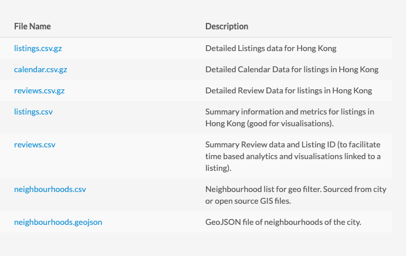
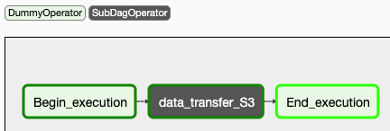
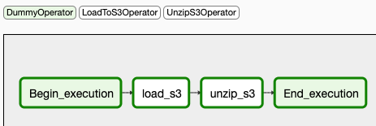

## Project: Data Pipeline for analyzing Inside Airbnb’s dataset
###Project Description: 
InsideAirbnb has a rich dataset of Airbnb listings, with which it has tried to help communities around the world from 2015. Beginning from this report http://insideairbnb.com/how-airbnb-hid-the-facts-in-nyc/ which exposed how the Airbnb released data misled the media and the public, to this Jersey City report, http://insideairbnb.com/inside-jersey-city/, which was instrumental in regulating short term rentals in Jersey City in 2019.

With this community project, I hope to make it easier to get and analyse Airbnb listings for communities all over the world in a scalable and cost-effective manner with the help of Apache Airflow, Amazon S3, S3 Select, BeautifulSoup, Apache Spark, Amazon EMR, Amazon Redshift and Amazon Athena.

###Data Pipeline design:
At a high-level the pipeline does the following tasks.
1. Scrape InsideAirbnb's website to get the URL of all the csv files, and dump it into a file on S3.
2. Based on User's Preference gotten from Airflow variables, transfer either the summary or detailed csv files to an S3 bucket directly, without writing anything locally.
3. Unzip and preprocess the raw data to perform data validation tasks.
4. Create a Data Lake on S3, from which data can be queried directly at Scale from either Amazon Athena or Amazon Redshift.
5. Provide Custom subdags and operators to model data using Data Warehousing techniques to create a Amazon Redshift Warehouse, from which data can be queried.
6. Provide Custom subdags and operators to analyze data directly from S3 at scale, using Spark on EMR clusters.
7. Provide Custom subdags and operators to run queries directly on the S3 Data Lake using Amazon Athena

**Note: This is a WIP(Work In Progress), currently the 2nd, 3rd and 4th Steps have been implemented and tested on sample Url's. I will continuously keep researching and updating the pipeline with the most cost-effective and scalable techniques currently out there.**

**If you are interested in contributing or see issues with it, please feel free to open an issue in the Issues Tab on Github.**

I will keep updating the README as well, with more implementation details.

**Data Description**
Inside Airbnb contains scraped data from the Airbnb website, dating back to 2015. There have been monthly updates on the data in the past couple of years, but before that we just have one dataset per year.

It contains data for various communities across the world, ranging from Australia, London, Paris, Belgium to China, and Of course the majority of US cities.

All the communities contain the same fields. Below you can find an example for the Hong Kong community

**Design Goals**:
* It should effectively backfill data from 2015
* The first stage of the data pipeline needs to be run on schedule once a month, if it finds new dataset URL for any community, it can trigger the data processing stage, and add the new data to the S3 DataLake. 

**Current Framework**
Currently I have designed and implmented the data transfer subdag, that loads data from the url file in S3 bucket, and unzips it and creates a data lake on S3.

>Current Dag Structure

>Data Transfer Subdag
**Pipeline Implementation**:

Apache Airflow is a Python framework for programmatically creating workflows in DAGs, e.g. ETL processes, generating reports, and retraining models on a daily basis. The Airflow UI automatically parses our DAG and creates a natural representation for the movement and transformation of data. A DAG simply is a collection of all the tasks you want to run, organized in a way that reflects their relationships and dependencies. A **DAG** describes *how* you want to carry out your workflow, and **Operators** determine *what* actually gets done. 

By default, airflow comes with some simple built-in operators like `PythonOperator`, `BashOperator`, `DummyOperator` etc., however, airflow lets you extend the features of a `BaseOperator` and create custom operators. For this project, I developed several custom operators. 

The description of each of these operators follows:
- **LoadToS3Operator**: Stages data to a specific redshift cluster from a specified S3 location. Operator uses templated fields to handle partitioned S3 locations.
- **UnzipS3Operator**: Loads data to the given fact table by running the provided sql statement. Supports delete-insert and append style loads.
 > Code for each of these operators is located in the **plugins/operators** directory.
 
Two or more operators can be grouped into one task using the SubDagOperator.
I am planning on creating several generic subdags, that can be reused later as well. Currently I just have a DataTransfer subdag
